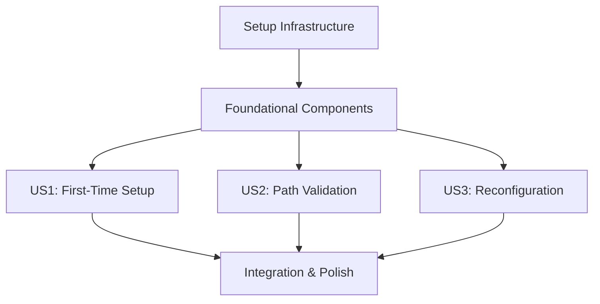

# Implementation Tasks: Dynamic OneDrive Path Configuration

**Feature Branch**: `009-dynamic-onedrive-path`  
**Created**: 2025-10-28  
**Total Tasks**: 23  

## Task Distribution by User Story

| Phase | User Story | Tasks | Parallelizable |
|-------|------------|--------|----------------|
| 1 | Setup Infrastructure | 3 tasks | 2 parallel |
| 2 | Foundational Components | 4 tasks | 3 parallel |
| 3 | US1: First-Time Path Setup | 6 tasks | 4 parallel |
| 4 | US2: Automatic Path Validation | 4 tasks | 3 parallel |
| 5 | US3: Path Reconfiguration | 3 tasks | 2 parallel |
| 6 | Integration & Polish | 3 tasks | 1 parallel |

## Phase 1: Setup Infrastructure

**Goal**: Initialize project structure and dependencies needed for all user stories

- [x] T001 Create path configuration module structure in `src/path_configuration.py`
- [x] T002 [P] Add configuration file schema constants and validation enums
- [x] T003 [P] Create custom exception classes for configuration errors

**Checkpoint**: Basic module structure exists with type definitions

---

## Phase 2: Foundational Components (Prerequisites)

**Goal**: Core infrastructure that must exist before any user story can be implemented

- [x] T004 Implement `PathConfiguration` dataclass with validation rules in `src/path_configuration.py`
- [x] T005 [P] Implement `ValidationResult` and supporting data structures in `src/path_configuration.py`
- [x] T006 [P] Implement `DirectoryPaths` dataclass for path management in `src/path_configuration.py`  
- [x] T007 [P] Create configuration file I/O utilities (JSON serialization/deserialization)

**Checkpoint**: Core data structures available for all user stories

---

## Phase 3: User Story 1 - First-Time Path Setup (Priority P1)

**Story Goal**: New users can configure OneDrive paths through interactive setup wizard

**Independent Test**: Run tool on fresh machine, complete setup wizard, verify configuration saves and tool proceeds with normal operation

**Implementation Tasks**:

- [x] T008 [US1] Implement `ConfigurationManager.load_configuration()` method in `src/path_configuration.py`
- [x] T009 [US1] [P] Implement `ConfigurationManager.save_configuration()` method in `src/path_configuration.py`
- [x] T010 [US1] [P] Implement path validation logic in `ConfigurationManager.validate_configuration()` method
- [x] T011 [US1] [P] Create `SetupWizard` class with interactive prompts in `src/path_configuration.py`
- [x] T012 [US1] [P] Implement setup wizard path input and validation flow
- [x] T013 [US1] Integrate setup wizard trigger in main application startup (`pricing_tool_accelerator.py`)

**Acceptance Criteria**:
- ✅ First-time users are prompted for OneDrive path configuration
- ✅ Setup wizard validates OneDrive folder structure (00-CONSTANTS, 10-LATEST-PRICING-TOOLS, 20-OUTPUT)  
- ✅ Valid configuration is saved to `~/.dtt-pricing-tool-populator-config`
- ✅ Tool proceeds with normal operation after successful configuration

**Checkpoint**: User Story 1 complete - first-time setup wizard working end-to-end

---

## Phase 4: User Story 2 - Automatic Path Validation (Priority P2)

**Story Goal**: Existing configurations are validated at startup with helpful error messages

**Independent Test**: Modify saved configuration to invalid paths, verify error handling and reconfiguration offers

**Implementation Tasks**:

- [x] T014 [US2] Implement startup path validation in main application entry point
- [x] T015 [US2] [P] Create user-friendly error messages for different validation failure scenarios
- [x] T016 [US2] [P] Implement automatic reconfiguration offer when paths become invalid
- [x] T017 [US2] [P] Add OneDrive sync status detection and guidance messaging

**Acceptance Criteria**:
- ✅ Configured paths are validated when tool starts  
- ✅ Clear error messages displayed when paths are inaccessible
- ✅ Users offered reconfiguration when validation fails
- ✅ Guidance provided for OneDrive sync issues

**Checkpoint**: User Story 2 complete - path validation and error recovery working

---

## Phase 5: User Story 3 - Path Reconfiguration (Priority P3)

**Story Goal**: Users can manually reconfigure paths when organizational structure changes

**Independent Test**: Run reconfiguration command, verify new paths are saved and used correctly

**Implementation Tasks**:

- [x] T018 [US3] Add `--configure-paths` command line option to force reconfiguration
- [x] T019 [US3] [P] Add `--show-config` command line option to display current configuration  
- [x] T020 [US3] [P] Implement manual reconfiguration workflow using existing setup wizard

**Acceptance Criteria**:
- ✅ `--configure-paths` flag triggers setup wizard for existing users
- ✅ `--show-config` displays current path configuration  
- ✅ Reconfiguration updates existing configuration file
- ✅ Subsequent runs use new configuration

**Checkpoint**: User Story 3 complete - manual reconfiguration capability working

---

## Phase 6: Integration & Polish

**Goal**: Complete integration with existing codebase and cross-cutting concerns

- [x] T021 Modify `src/constants.py` to use dynamic path resolution with hardcoded fallbacks
- [x] T022 [P] Update existing modules to use `get_configured_paths()` for directory access
- [x] T023 Add comprehensive error handling and logging throughout path configuration system

**Final Checkpoint**: All user stories integrated, backwards compatibility maintained

---

## Dependencies & Execution Strategy

### User Story Dependencies

### Parallel Execution Opportunities

**Phase 2 (Foundational)**: T005, T006, T007 can run in parallel after T004 completes  
**Phase 3 (US1)**: T009, T010, T011, T012 can run in parallel after T008 completes  
**Phase 4 (US2)**: T015, T016, T017 can run in parallel after T014 completes  
**Phase 5 (US3)**: T019, T020 can run in parallel after T018 completes  

### MVP Strategy

**Minimum Viable Product**: Complete Phase 1-3 (User Story 1 only)
- Enables basic OneDrive path configuration for new deployments
- Solves the core deployment compatibility problem
- Provides foundation for additional user stories

**Incremental Delivery**:
1. **MVP Release**: User Story 1 (first-time setup)
2. **Enhancement 1**: Add User Story 2 (validation & error handling)  
3. **Enhancement 2**: Add User Story 3 (manual reconfiguration)
4. **Polish Release**: Integration improvements and advanced features

### File-Level Task Organization

**`src/path_configuration.py`** (Primary new file):
- T001, T002, T004, T005, T006, T008, T009, T010, T011, T012

**`pricing_tool_accelerator.py`** (Integration point):  
- T013, T014, T018

**`src/constants.py`** (Backwards compatibility):
- T021

**Error Handling & Integration** (Cross-cutting):
- T003, T007, T015, T016, T017, T019, T020, T022, T023

### Testing Strategy (Optional)

*Note: Tests not explicitly requested in specification, but recommended for reliability*

**If tests are implemented**:
- Unit tests for PathConfiguration data validation
- Mock filesystem tests for ConfigurationManager operations  
- Integration tests for setup wizard flow
- Error scenario testing with invalid configurations

### Success Metrics

Upon completion, verify all success criteria are met:

- ✅ 100% of users with different OneDrive mappings can complete initial setup
- ✅ Tool startup remains under 5 seconds after configuration
- ✅ Path validation catches 95% of common OneDrive accessibility issues  
- ✅ Users can reconfigure paths in under 30 seconds
- ✅ Setup wizard has less than 5% error rate for valid OneDrive structures
- ✅ Zero hard-coded OneDrive paths remain in production code